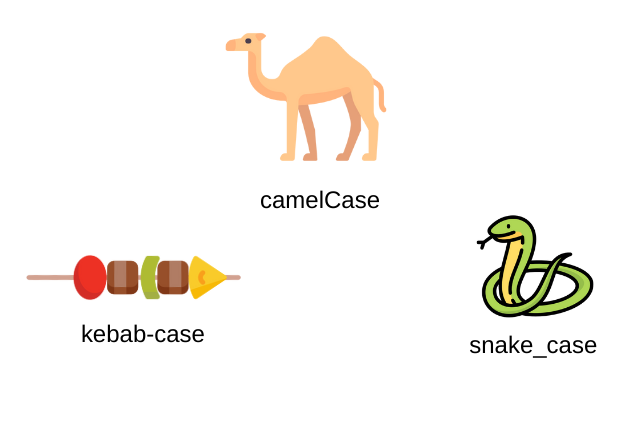

# DOM Manipulation And Events

When HTML is parsed by the browser its converted to dom

One of the unique abilities of js is to modify the dom tree

So we can target nodes in the tree with selectors

The following is diffrent methods to refer to the div with **class** *display*

```html
div.display = <div class="display"></div>
--------------------------------------
.display class="display"
--------------------------------------
#container > .display 
<div id="container">
    <div class="display">
    </div>
--------------------------------------
div#container > div.display
</div>
<div id="container">
    <div class="display"></div>
</div>
--------------------------------------
```

## **Relational selectors**
``` html
<div id="container">
  <div class="display"></div>
  <div class="controls"></div>
</div>
 ```
```js
const container = document.querySelector('#container');
// selects the #container div

console.dir(container.firstElementChild);                      
// selects the first child of #container => .display

--------------------------------------

const controls = document.querySelector('.controls');   
// selects the .controls div

console.dir(controls.previousElementSibling);                  
// selects the prior sibling => .display
```

## DOM Methods

Nodes are **objects** that have many **properties** and **methods** attached to them. 

These properties and methods are the primary tools we are going to use to manipulate our webpage with JavaScript.

### Query Selectors

Query Selectors help us **target** nodes

> element.querySelector(selector) returns a refrence to the first match of selector
> 
> element.querySelectorAll(selectors) returns a "node list" containing all refrences to all matches of the selector, it might look like an array but its not, its a node list, sevral array methods are missing from node lists, you can convert it into an array if u need those methods with Array.from() or ...([spread operator](https://developer.mozilla.org/en-US/docs/Web/JavaScript/Reference/Operators/Spread_syntax))

PS : There are several other, more specific queries, that offer potential (marginal) performance benefits,

### Element Creation
```js
Syntax

document.createElement(tagName, [options])
//Example
const div = document.createElement('div');
```
[options] are the optional params that we can add

This does not put the elem into the DOM, it simply creates it in memory

We can manipulate it by adding styles, classes, ids, text etc be4 placing it

### **Element Placements**

#### **Append Elements**


```js
parentNode.appendChild(childNode)
// appends childNode as the last child of parentNode
parentNode.insertBefore(newNode, referenceNode)
// inserts newNode into parentNode before referenceNode
```
#### **Remove Elements**

```js
parentNode.removeChild(child)
// removes child from parentNode on the DOM and returns a reference to child
```
#### **Altering  Elements**

For example you created a div element from js

You have a refrence to it, and you can use it to alter its attributes, classes

```js
const div = document.createElement('div'); 

div.style.color = 'blue';                                      
// adds the indicated style rule

div.style.cssText = 'color: blue; background: white;';          
// adds several style rules

div.setAttribute('style', 'color: blue; background: white;');    
// adds several style rules
```
[See DOM Enlightenment’s section on CSS Style rules for more info on inline styles.](http://domenlightenment.com/#6.2)

Here is how to access a kebabstyled css, by using bracket notation, or camelCase

<p align="center">
  
</p>

```js
div.style.background-color 
// doesn't work - attempts to subtract color from div.style.background

div.style.backgroundColor 
// accesses the div's background-color style
div.style['background-color'] 
// also works
div.style.cssText = "background-color: white;" 
// ok in a string
```

#### **Editing   Attributes**

```js
div.setAttribute('id', 'theDiv');                              
// if id exists, update it to 'theDiv', else create an id
// with value "theDiv"

div.getAttribute('id');                                        
// returns value of specified attribute, in this case
// "theDiv"

div.removeAttribute('id');                                     
// removes specified attribute
```

#### **Working with Classes**

The standard way (and cleaner way) is to toggle a CSS style rather than adding and removing inline CSS.

```js
div.classList.add('new');                                      
// adds class "new" to your new div

div.classList.remove('new');                                   
// removes "new" class from div

div.classList.toggle('active');                                
// if div doesn't have class "active" then add it, or if
// it does, then remove it
```

#### **Adding Text Content**

```js
div.textContent = 'Hello World!'                               
// creates a text node containing "Hello World!" and
// inserts it in div
```

#### **Adding HTML Content**

```js
div.innerHTML = '<span>Hello World!span>';                   
// renders the HTML inside div
```

## Small Recap

Js will not alter your html, it will only change what your browser renders


