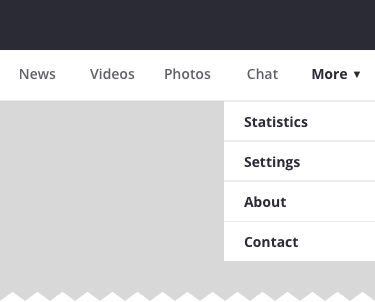
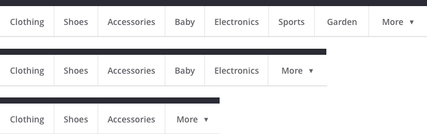
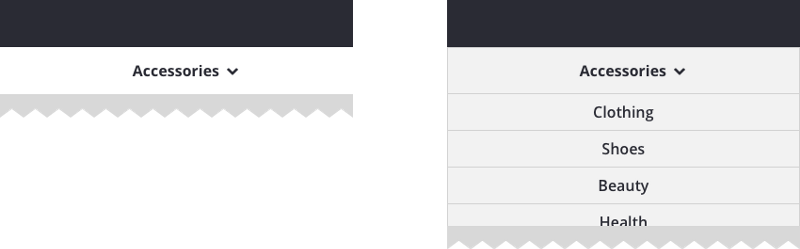
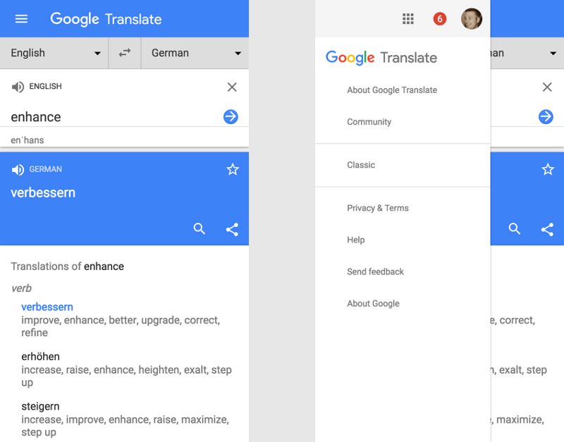

# Navigation

# Tabs

Tabs are very nice when u have less than 5, u can make tabs have 5 items and a more section if u get stuck
> They can either be in top or bottom

```
You have to use Icons and labels that are really common (ex: Social medial apps icons)
```

```
All these are good when it comes to followwing the patern, but the one with icons + text seems to be the best option
```
> Example of how to include **more** tab
> 



# Progressively collapsing tabs



# Dropdown menus



# Hamburger menu

The hamburger navigation has low discoverability and efficiency, but can be usefull in certain situations

```
Secondary navigation is where hamburger menu shines, we put all the garbage that is not essential to the UX in there, like **help** **contact** and other sections
```


